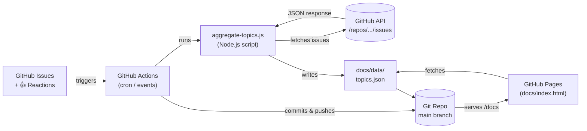
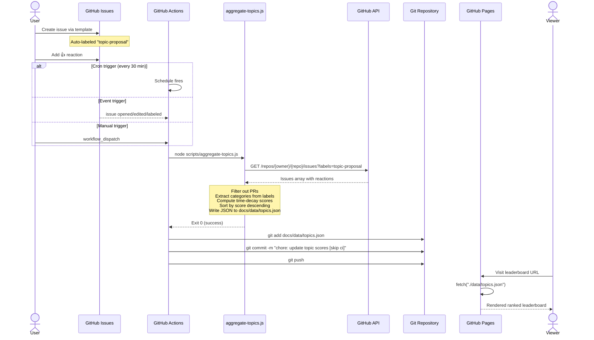
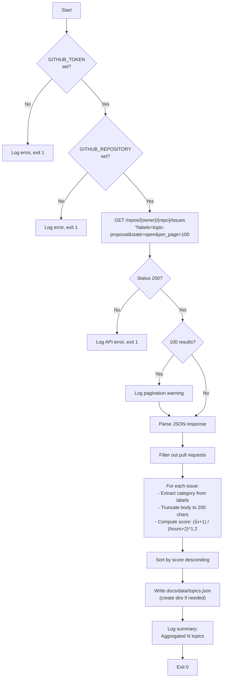

# Open GH Vote

A lightweight POC for an open-source, fully GitHub-native leaderboard for idea submissions.
Users submit ideas via GitHub Issues, ideas appear on a leaderboard hosted on GitHub Pages,
and ideas are ranked by 👍 reactions using a time-decay scoring algorithm.

## Architecture

### System Overview



### End-to-End Data Flow

This sequence diagram shows the full loop from proposal to leaderboard display:



### Aggregation Script Internals



## Repository Structure

```
├── .github/
│   ├── ISSUE_TEMPLATE/
│   │   └── topic-proposal.yml        # Structured issue form (YAML format)
│   └── workflows/
│       └── aggregate-votes.yml        # Actions workflow (cron + event triggers)
├── scripts/
│   └── aggregate-topics.js            # Aggregation script (zero npm dependencies)
├── docs/                              # GitHub Pages source (served from /docs)
│   ├── index.html                     # Single-page leaderboard UI
│   └── data/
│       └── topics.json                # Generated output (committed by Actions)
├── CLAUDE.md                          # This file — project context for AI assistants
└── README.md                          # User-facing setup and usage guide
```

## Components

### Issue Template (`.github/ISSUE_TEMPLATE/topic-proposal.yml`)

Uses the YAML-based issue form format (not the older markdown template format).

- Auto-applies label: `topic-proposal` (label must exist in the repo before issues are created)
- Sets issue title from a prefix: `[Topic] `
- Fields:
  - **Topic Title** (input, required) — short name for the proposed topic
  - **Description** (textarea, required) — what the topic is about and why it matters
  - **Category** (dropdown, required) — one of: `Methodology`, `Tooling`, `Case Study`, `Framework`, `Other`

### Actions Workflow (`.github/workflows/aggregate-votes.yml`)

**Triggers:**
- `schedule`: Cron every 30 minutes (`*/30 * * * *`)
- `issues`: On `opened`, `edited`, `deleted`, `labeled`, `unlabeled`
- `issue_comment`: On `created`
- `workflow_dispatch`: Manual trigger for testing

**Permissions:** `contents: write`, `issues: read` (least privilege).

**Steps:**
1. Checkout repo (`actions/checkout@v4`)
2. Setup Node.js 20 (`actions/setup-node@v4`)
3. Run `node scripts/aggregate-topics.js` with `GITHUB_TOKEN` and `GITHUB_REPOSITORY` env vars
4. Commit and push if `docs/data/topics.json` changed

**Commit behavior:** Uses `git diff --cached --quiet || git commit` pattern so nothing is committed when there are no changes. Commit message includes `[skip ci]` to prevent recursive workflow triggers. Commits as `github-actions[bot]`.

**Environment variables:** `GITHUB_TOKEN` (auto-provided by Actions, no manual secret needed) and `GITHUB_REPOSITORY` (format: `owner/repo`, auto-provided by Actions context).

### Aggregation Script (`scripts/aggregate-topics.js`)

**Zero external dependencies.** Uses only Node.js built-ins: `https`, `fs`, `path`. No `package.json` or `npm install` needed.

**API call:**
```
GET /repos/{owner}/{repo}/issues?labels=topic-proposal&state=open&per_page=100
Headers: Authorization: Bearer {token}, Accept: application/vnd.github+json, X-GitHub-Api-Version: 2022-11-28
```

**Pagination:** Capped at 100 issues (API max per page). Logs a warning if the response contains 100 items indicating pagination may be needed. Full pagination is deferred to the backlog.

**PR filtering:** The GitHub Issues API can return pull requests. The script filters these out via `issue.pull_request` presence check.

**Category extraction:** Takes the first label on the issue that is not `topic-proposal`. Falls back to `"Uncategorized"` if no other labels exist.

**Description truncation:** Issue body is truncated to 200 characters with `...` appended if truncated. Empty bodies produce an empty string.

**Error handling:**
- Missing `GITHUB_TOKEN` or `GITHUB_REPOSITORY` → clear error message, exit code 1
- API failure (non-200 status) → logs error with status and partial response body, exit code 1
- JSON parse failure → logs error, exit code 1
- Zero matching issues → writes JSON with empty `topics` array (does not skip the write)

**Output path:** `docs/data/topics.json` (relative to repo root). Creates the `docs/data/` directory if it doesn't exist.

### GitHub Pages Site (`docs/index.html`)

Single self-contained HTML file. No build step, no framework, no external dependencies. Inline CSS with system fonts.

**Data fetching:** Fetches `./data/topics.json` via relative path (works because both `index.html` and `data/topics.json` are inside `/docs`).

**Repo detection:** Auto-detects `owner/repo` from the GitHub Pages URL pattern (`{owner}.github.io/{repo}/`) to construct the "Propose a Topic" link. Falls back gracefully if detection fails.

**Displays for each topic:** Rank number, title (linked to issue URL), description snippet, vote count (👍), comment count (💬), category badge, relative time ("3 days ago"), score (muted, for debugging).

**States:** Loading spinner → rendered list, empty state ("No topics proposed yet. Be the first!"), or error message on fetch failure.

**Footer:** Shows `generated_at` timestamp from the JSON so users can verify the cron is running.

## Scoring Algorithm

```javascript
score = (thumbsUp + 1) / Math.pow(hoursAge + 2, 1.2)
```

Where:
- `thumbsUp` = `issue.reactions["+1"]` (only 👍 reactions count)
- `hoursAge` = hours since issue creation
- `+ 1` in numerator ensures zero-vote issues still appear (ranked lower)
- `+ 2` in denominator prevents division by zero and dampens brand-new issues
- Gravity of `1.2` provides moderate decay — a week-old issue needs ~3x the votes of a new issue to rank equally
- Mirrors the Hacker News ranking algorithm approach

Scores are rounded to 4 decimal places in the JSON output.

## JSON Output Format (`docs/data/topics.json`)

```json
{
  "generated_at": "2025-02-07T15:30:00Z",
  "total_topics": 12,
  "topics": [
    {
      "id": 42,
      "title": "Building evaluation frameworks for LLM features",
      "description": "The body text of the issue (first 200 chars)...",
      "url": "https://github.com/owner/repo/issues/42",
      "author": "username",
      "category": "Methodology",
      "created_at": "2025-02-01T10:00:00Z",
      "votes": 7,
      "comment_count": 3,
      "score": 2.4523,
      "labels": ["topic-proposal", "methodology"]
    }
  ]
}
```

- `topics` array is sorted by `score` descending (highest first)
- JSON is written with 2-space indentation for readable git diffs
- Script logs: `"Aggregated {n} topics. Top: '{title}' (score: {score})"`

## Key Design Decisions

- **Zero external dependencies**: Aggregation script uses only Node.js built-ins (`https`, `fs`, `path`). No `package.json`, no `npm install`. This simplifies the workflow and avoids enterprise policy issues with npm registries.
- **GitHub Pages served from `/docs`**: JSON output goes to `docs/data/topics.json` so Pages can fetch it via relative path. This keeps everything self-contained in the `/docs` directory (Option A from the spec).
- **Only 👍 reactions count** for the POC. Other reaction types are out of scope.
- **Only first-party GitHub Actions** used: `actions/checkout@v4` and `actions/setup-node@v4`. Both are owned by the `actions` org (GitHub itself), which should be allowed by most enterprise org policies.
- **No external API calls**: Everything uses `api.github.com` via the auto-provided `GITHUB_TOKEN`.
- **`[skip ci]` on auto-commits**: Prevents the workflow's own commits from re-triggering workflows that listen on `push` events.
- **Bot commit identity**: Uses `github-actions[bot]` name and email for clear attribution.

## Development

- No build step. All files are static or run directly via Node.js.
- To test the aggregation script locally:
  ```bash
  GITHUB_TOKEN=<pat> GITHUB_REPOSITORY=owner/repo node scripts/aggregate-topics.js
  ```
- The workflow auto-commits `docs/data/topics.json` with `[skip ci]` to avoid recursive triggers.
- To test the HTML locally, you need a web server (fetch won't work from `file://`):
  ```bash
  cd docs && python3 -m http.server 8000
  # Then visit http://localhost:8000
  ```
  (Requires `docs/data/topics.json` to exist — run the aggregation script first or create a sample file.)

## Enterprise Migration Notes

Before migrating to an enterprise org, verify:

- `actions/checkout@v4` and `actions/setup-node@v4` are allowed (first-party GitHub Actions)
- No external API calls — only `api.github.com` via `GITHUB_TOKEN`
- No npm dependencies — script uses only Node.js built-ins
- GitHub Pages is enabled for the org (some orgs restrict this)
- Issue templates work on GitHub Enterprise Cloud (standard feature)

**Fallback if Actions are restricted:** Replace `actions/checkout` with bare `git` commands in a `run:` step, and rely on pre-installed Node.js on `ubuntu-latest` instead of `actions/setup-node`.

## Out-of-Scope Backlog

Items referenced but deferred beyond the POC:

- [ ] Visual design / polish
- [ ] Category filtering in the UI
- [ ] Search functionality
- [ ] Linking issues to published content
- [ ] Multiple reaction types (beyond 👍)
- [ ] API pagination (currently capped at 100 issues)
- [ ] UI pagination
- [ ] Authentication or user-specific views
- [ ] Mobile responsiveness
